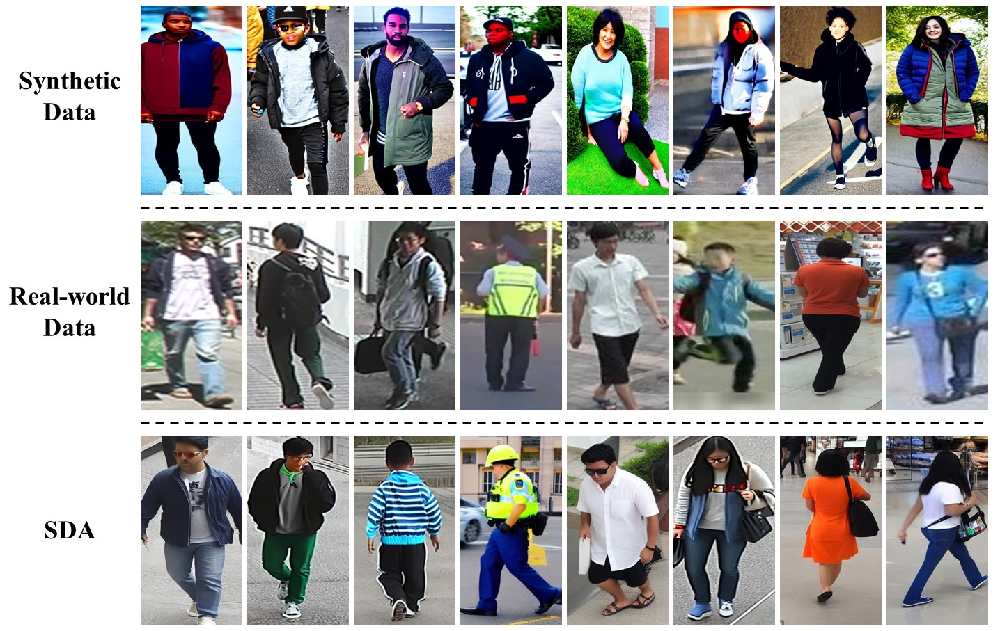
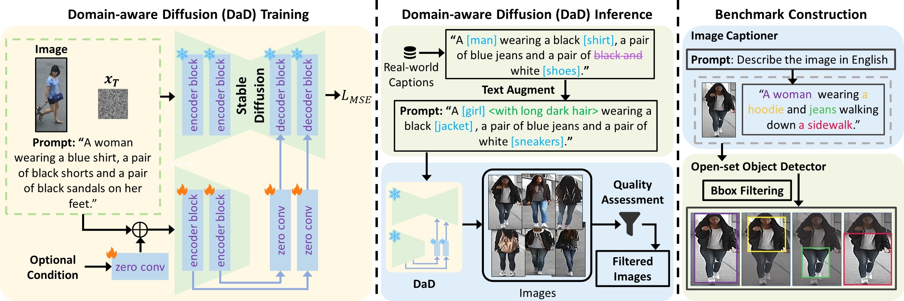
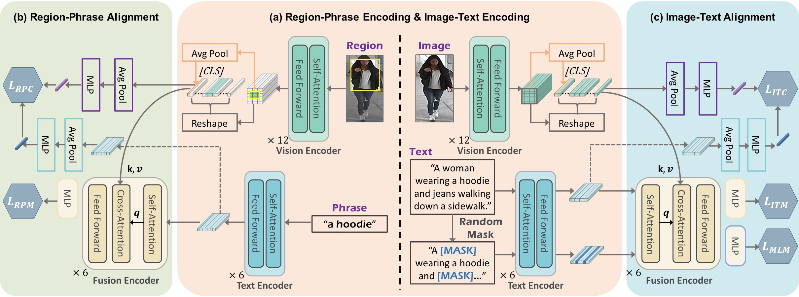

# MRA: Multi-granularity Relation Alignment framework for text-based person retrieval pretraining.

[](https://paperswithcode.com/sota/nlp-based-person-retrival-on-cuhk-pedes?p=minimizing-the-pretraining-gap-domain-aligned)
[](https://paperswithcode.com/sota/text-based-person-retrieval-on-icfg-pedes?p=minimizing-the-pretraining-gap-domain-aligned)
[](https://paperswithcode.com/sota/text-based-person-retrieval-on-rstpreid-1?p=minimizing-the-pretraining-gap-domain-aligned)

**[Minimizing the Pretraining Gap: Domain-aligned Text-Based Person Retrieval](https://arxiv.org/abs/2507.10195) 
Shuyu Yang, Yaxiong Wang, Yongrui Li, Li Zhu, Zhedong Zheng. arXiv 2025.**


## News
- Jul 2025: Release our proposed SDA dataset at 
[OneDrive](https://1drv.ms/f/c/afc02d7952f9b34d/Ek2z-VJ5LcAggK_7DgAAAAABuACeAfiQc6heCL-RLhGDww?e=aVmDVr) 
& [Baidu Yun](https://pan.baidu.com/s/1-DqZ0nJ1cJEe496ngTwTsQ) [a987]
- Jul 2025: Release MRA checkpoints at 
[Google Drive](https://drive.google.com/drive/folders/1D8g5t8JlmdaA_lhEJkZWiFR5aA0WWHnS?usp=sharing) 
& [Baidu Yun](https://pan.baidu.com/s/1sRWeVPckg4CAi_LYn0X5BQ) [6qcs]
- Jul 2025: Release official PyTorch implementation of MRA  
- Jul 2025: Release preprint in [arXiv](https://arxiv.org/abs/2507.10195)


Our work tackles **text-based person retrieval**. 
To bridge the significant **domain gap** between **synthetic pretraining data** 
and **real-world target datasets** (e.g., CUHK-PEDES), we propose a unified dual-level domain adaptation framework:

<div align="center"></div>

- **Image-Level Adaptation: Domain-aware Diffusion (DaD).**
DaD migrates the distribution of images from the pretraining dataset domain to the target real-world dataset domain.
DaD generates domain-aligned data for pretraining. The synthetic data forms the **Synthetic Domain-Aligned dataset (SDA)**. 

- **Region-Level Adaptation: Multi-granularity Relation Alignment (MRA).**
MRA performs a meticulous region-level alignment by establishing correspondences between visual regions and their descriptive sentences, thereby addressing disparities at a **finer granularity**.
Our method achieves state-of-the-art (**SOTA**) performance on the CUHK-PEDES, ICFG-PEDES, and RSTPReid datasets. 

More details can be found at our paper: 
[Minimizing the Pretraining Gap: Domain-aligned Text-Based Person Retrieval](https://arxiv.org/abs/2507.10195). 


## DaD
To migrate the domain gap between the synthetic and real-world domain, we fine-tune a Text-to-Image Diffusion Model on the target domain dataset and represent the fine-tuned model as Domain-aware Diffusion (DaD). 
As shown in the following figure, we deploy DaD for accomplishing image-level domain adaptation, followed by data filtering (about **10.63%** images are filtered). 
Then, we construct a synthetic pedestrian image-text pair dataset, SDA, with **region annotations** using off-the-shelf tools. 

<div align="center"></div>


## SDA
SDA contains **1,217,750** image-text pairs which are approximately **20 times** compared with the CUHK-PEDES training set (68,126). 
To the best of our knowledge, this is the first pedestrian dataset with region annotations. 

The dataset is released at [OneDrive](https://1drv.ms/f/c/afc02d7952f9b34d/Ek2z-VJ5LcAggK_7DgAAAAABuACeAfiQc6heCL-RLhGDww?e=aVmDVr) 
& [Baidu Yun](https://pan.baidu.com/s/1-DqZ0nJ1cJEe496ngTwTsQ) [a987]. 

**Note that SDA can only be used for research; any commercial usage is forbidden.**

Annotation format:

```
[
{"image": "c_0_5000/0_0.jpg", 
"boxes": [[0.5621, 0.4998, 0.853, 0.9712], [0.5649, 0.3704, 0.8504, 0.4376]], 
"logits": [0.7473, 0.4396], 
"phrases": ["a man", "a black shirt"], 
"caption": "a man wearing a black shirt and red shoes", 
"image_id": 0},
...
]
```


## Models and Weights
This is an overview of the proposed Multi-granularity Relation Alignment (MRA) framework.

<div align="center"></div>

The pretrained and fine-tuned checkpoints have been released at the `checkpoint` folder in
[Google Drive](https://drive.google.com/drive/folders/1D8g5t8JlmdaA_lhEJkZWiFR5aA0WWHnS?usp=sharing) 
& [Baidu Yun](https://pan.baidu.com/s/1sRWeVPckg4CAi_LYn0X5BQ) [6qcs].


## Usage

### Install Requirements

We use 4 NVIDIA GeForce RTX 3090 GPUs (24G) for pretraining and 4 NVIDIA A100 GPUs (40G) for fine-tuning.

Clone the repo:
```
git clone https://github.com/Shuyu-XJTU/MRA.git
cd MRA
```

Create conda environment and install dependencies:
```
conda create -n mra python=3.10
conda activate mra
# Ensure torch >= 2.0.0 and install torch based on CUDA Version
# For example, if CUDA Version is 11.8, install torch 2.2.0:
pip install torch==2.2.0 torchvision==0.17.0 torchaudio==2.2.0 --index-url https://download.pytorch.org/whl/cu118
pip3 install -r requirements.txt
```

For the first time you use wordnet
```
python
>>> import nltk
>>> nltk.download('wordnet')
```

### Datasets Prepare

Download the CUHK-PEDES dataset from [here](https://github.com/ShuangLI59/Person-Search-with-Natural-Language-Description),
the RSTPReid dataset from [here](https://github.com/NjtechCVLab/RSTPReid-Dataset), 
and the ICFG-PEDES dataset from [here](https://github.com/zifyloo/SSAN). 

Download the processed JSON files of the above 3 datasets from the `finetune` folder in 
[Google Drive](https://drive.google.com/drive/folders/1D8g5t8JlmdaA_lhEJkZWiFR5aA0WWHnS?usp=sharing) 
& [Baidu Yun](https://pan.baidu.com/s/1sRWeVPckg4CAi_LYn0X5BQ) [6qcs].

Download pre-trained models for parameter initialization:

- vision encoder: [swin-transformer-base](https://github.com/SwinTransformer/storage/releases/download/v1.0.0/swin_base_patch4_window7_224_22k.pth)

- text encoder: [bert-base](https://huggingface.co/bert-base-uncased/tree/main)

Organize `data` folder as follows:

```
|-- data/
|    |-- swin_base_patch4_window7_224_22k.pth
|    |-- bert-base-uncased/
|    |-- checkpoint/
|        |-- pretrain.pth
|        |-- ft_cuhk.pth
|        |-- ft_icfg.pth
|        |-- ft_rstp.pth
|    |-- sda/
|        |-- sda_0_5000.json
|        |-- ...
|    |-- finetune/
|        |-- cuhk_train.json
|        |-- ...
|        |-- icfg_train.json
|        |-- ...
|        |-- rstp_train.json
|        |-- ...

```

And organize all datasets in `images` folder as follows:

```
|-- images/
|    |-- <SDA>/
|        |-- c_0_5000/
|        |-- ...
|
|    |-- <CUHK-PEDES>/
|        |-- imgs/
|            |-- cam_a/
|            |-- cam_b/
|            |-- ...
|            |-- train_query/
|
|    |-- <ICFG-PEDES>/
|        |-- test/
|        |-- train/
|
|    |-- <RSTPReid>/
```

### Pretraining
We pretrain our MRA using SDA as follows：

```
python3 run.py --task "sda" --dist "f4" --output_dir "out/pre_sda"
```

### Fine-tuning
We fine-tune our MRA using existing text-based Person Reid datasets. 
Performance can be improved by replacing the backbone with our pre-trained model. 

Taking CUHK-PEDES as an example:

```
python3 run.py --task "cuhk" --dist "f4" --output_dir "out/ft_cuhk" --checkpoint "data/checkpoint/pretrain.pth"
```

### Evaluation

```
python3 run.py --task "cuhk" --dist "f4" --output_dir "out/eval_cuhk" --checkpoint "data/checkpoint/ft_cuhk.pth" --evaluate 
```


## Reference
If you use MRA or SDA in your research, please cite it by the following BibTeX entry:

```
@article{yang2025minimizing,
  title={Minimizing the Pretraining Gap: Domain-Aligned Text-Based Person Retrieval},
  author={Yang, Shuyu and Wang, Yaxiong and Li, Yongrui and Zhu, Li and Zheng, Zhedong},
  journal={arXiv preprint arXiv:2507.10195},
  year={2025}
}
```
